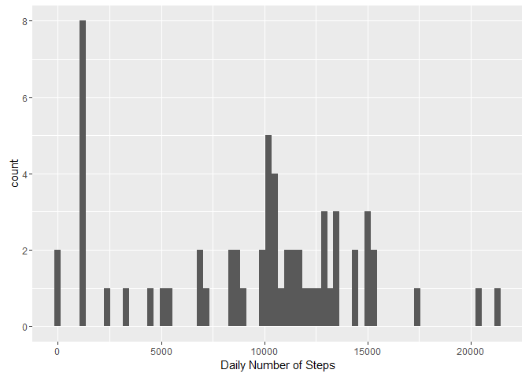

# Reproducible Research: Peer Assessment 1


## Loading and preprocessing the data

      * assumes that zip file is in the working directory
      * loading the data and necessary libraries
      * change the date to date format


```r
      unzip("activity.zip")
      activity<- read.csv("activity.csv")
      library(plyr)
      library(ggplot2)
      library(dplyr)
```

```
## 
## Attaching package: 'dplyr'
```

```
## The following objects are masked from 'package:plyr':
## 
##     arrange, count, desc, failwith, id, mutate, rename, summarise,
##     summarize
```

```
## The following objects are masked from 'package:stats':
## 
##     filter, lag
```

```
## The following objects are masked from 'package:base':
## 
##     intersect, setdiff, setequal, union
```

```r
      activity$date <- as.POSIXct(activity$date)
```


## What is mean total number of steps taken per day?

### Histogram

      * Uses qplot for creating a Histogram for steps for each day. 
      
      * Accordingly labels the chart and formats the axis. Stores the formula in a variable before opening a            graphic device (pdf file).
      
      * Prints the chart to device(file)
      
      * closes the graphic device
      
      * Histogram can be found in the file histogram.pdf in the working directory, also displays the graph in html
      


```r
#Calculate the total number of steps taken per day
dailysteps <- aggregate(activity$steps, by = list(activity$date), sum, na.rm=TRUE) 
names(dailysteps) <- c("Date", "steps")

#Make a histogram of the total number of steps taken each day
histogram<- qplot(steps, data = dailysteps, geom="histogram", xlab = "Daily Number of Steps", binwidth = 300)
pdf(file="histogram.pdf", title = "Histogram of steps")
histogram
dev.off()
```

```
## png 
##   2
```

```r
histogram
```


 

      ### Mean and Median number of steps per day
      

             * Mean number of steps per day
                  + First get the aggregate steps for each day and then take mean for all days
                  

```r
      mean.steps <- mean(dailysteps$steps) 
      
      mean.steps<- round(mean.steps)
```
             * Median number of steps per day
                  + First get the aggregate steps for each day and then take median for all days
                  
                  

```r
      median.steps <- median(dailysteps$steps)
```

> The Mean number of steps are 9354 and median number of steps are 10395 


 
## What is the average daily activity pattern?

      >  * Getting the aggregate of  mean steps during each 5 minute time interval across days in intervaldata variable
      
      

```r
# getting the mean across interval in new variable
intervaldata<- aggregate(steps~interval, data= activity, FUN = mean, na.rm=TRUE)
# rounding off the mean
intervaldata$steps<- round(intervaldata$steps)
# assigning column name
names(intervaldata)<- c("interval", "meansteps") 
# getting the median across interval in new variable
intervaldatamedian<- aggregate(steps~interval, data= activity, FUN = median, na.rm=TRUE)
# Rounding
intervaldatamedian$steps<- round(intervaldatamedian$steps)
# new Column names
names(intervaldatamedian)<- c("interval", "mediansteps") 
```
> Creating the timeseries chart with this data (mean) and saving it in pdf "timeseries.pdf" file, also displaying on the terminal


```r
      timeseries<- ggplot(intervaldata, aes(interval, meansteps)) + geom_line() + xlab("Time Interval") + ylab("Steps")+ggtitle("TimeSeries plot")+scale_x_discrete( limits=c(0,400,800,1200,1600,2000,2355))+theme(axis.text.x = element_text(angle = 40, hjust = 1))
 pdf(file = "timeseries.pdf",title = "Time Series Plot")
      timeseries
      dev.off()
```

```
## png 
##   2
```

```r
      timeseries
```


#### Calculating the most average steps during any interval, across days

```r
moststeps <- intervaldata$interval[intervaldata$steps == max(intervaldata$steps)]
```

```
## Warning in max(intervaldata$steps): no non-missing arguments to max;
## returning -Inf
```
The 5-minute interval, on average across all the days in the dataset, which contains the maximum number of steps  is 
       


## Imputing missing values

1.  Calculate and report the total number of missing values in the dataset (i.e. the total number of rows with `NA`s) 

* we just need to calculate the missing values for steps = NA


```r
na.steps <- subset(activity, is.na(steps))
num.NAs <-length(na.steps$steps)
```
>  The total number of missing values in the dataset are 2304 

2. Devise a strategy for filling in all of the missing values in the dataset

 * we should fill the NAs with median steps for that interval across all days, we have already calculated the median steps above and stored in "intervaldatamedian"
 * we need to create a new data frame from Activity where NA's are replaced by median, from the "intervaldatamedian" 
 
 

```r
#replace the NAs with the median number of steps for that period, keeping the column names same as Activity dataframe
newsteps <- data.frame(date=activity$date[is.na(activity$steps)], interval = activity$interval[is.na(activity$steps)], steps=intervaldatamedian[match(intervaldatamedian$interval, activity$interval[is.na(activity$steps)]),2])
```


3. Create a new dataset that is equal to the original dataset but with the missing data filled in.


```r
# removing the NA's from the period
activity <- subset(activity, !is.na(steps))

# Append the median steps to the Activity DF
activity <- rbind(activity, newsteps)
```

4. Make a histogram of the total number of steps taken each day and Calculate and report the **mean** and **median** total number of steps taken per day. 


```r
#sum the number of steps each day into the dailystepsnew DF and get the mean and median 
dailystepsnew <- aggregate(activity$steps, by = list(activity$date), sum, na.rm=TRUE)
names(dailystepsnew) <- c("Date", "steps")

newhistogram<- qplot(steps, data = dailystepsnew, geom="histogram", xlab = "Daily Number of Steps", binwidth = 300)

#saving histogram in a pdf file
pdf(file = "newhistogram.pdf", title = "New Histogram")

newhistogram

dev.off()
```

```
## png 
##   2
```

```r
#display histogram on screen

newhistogram
```



```r
#calculation of mean and median on new data

meanstepsnew <- round(mean(dailystepsnew$steps))  
medianstepsnew <- round(median(dailystepsnew$steps))
```

> The mean number of steps are 9504 and median steps are 10395 . Mean is different from ealier calculation but Median is same because we filled in the data with Median only. 


## Are there differences in activity patterns between weekdays and weekends?

1. Create a new factor variable in the dataset with two levels -- "weekday" and "weekend" indicating whether a given date is a weekday or weekend day.


```r
# Adds the Weekday/weekend identifier

activity$week <- ifelse(weekdays(activity$date) == "Saturday" | weekdays(activity$date) == "Sunday" ,"weekend","weekday")

#new dataframe of the mean  number of steps taken, averaged across all days, the activity data frame now has filled in missing values

intervaldatamean2 <- aggregate(activity$steps, by = list(activity$week, activity$interval), mean, na.rm=TRUE)

# correcting column names and rouding off values of mean steps

names(intervaldatamean2) = c("weekday", "interval","meansteps")
intervaldatamean2$meansteps <- round(intervaldatamean2$meansteps)
```


1. Make a panel plot containing a time series plot (i.e. `type = "l"`) of the 5-minute interval (x-axis) and the average number of steps taken, averaged across all weekday days or weekend days (y-axis)


```r
#using ggplot2
weekplot<- ggplot(intervaldatamean2, aes(x = interval, y = meansteps)) + ylab("Number of Steps") + geom_line() + facet_grid(weekday~.)+ggtitle("Weekday and Weekend TimeSeries panel plot")+scale_x_discrete( limits=c(0,400,800,1200,1600,2000,2355))+theme(axis.text.x = element_text(angle = 40, hjust = 1))+xlab("Interval")

#saving the plot to pdf file

pdf(file = "panelplot.pdf", title = "Weekday and Weekend Timeseries Panel Plot")

weekplot

dev.off()
```

```
## png 
##   2
```

```r
#displaying plot on screen 
weekplot
```


> There is clear diffrence between weekday and weekend maximums of steps across interval 


```r
weekmax<- intervaldatamean2 %>% group_by(weekday) %>% slice(which.max(meansteps))
weekdayint<- as.integer(weekmax[1,2])
weekdaystep<- as.integer(weekmax[1,3])
weekendint<- as.integer(weekmax[2,2])
weekendstep<- as.integer(weekmax[2,3])
```

 * On week days, average maximum steps are at interval  0835 with 205 steps
 * On weekends, average maximum steps are at interval  0915 with 155 steps


